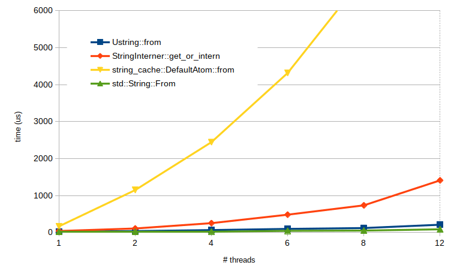
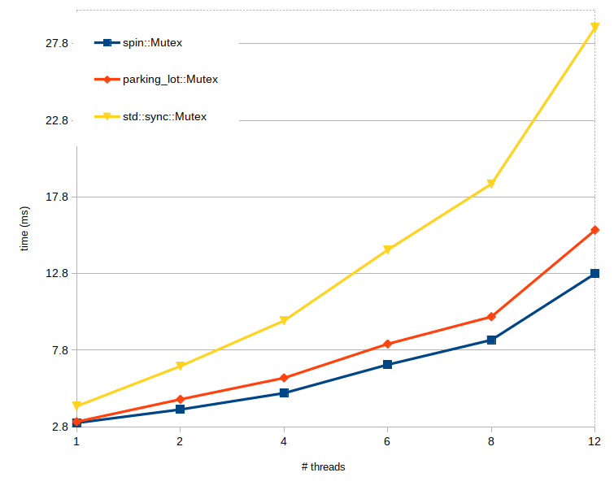

# Ustr
Fast, FFI-friendly string interning. 

| | | |
|-|-|-|
| [![Build Status]][travis] | [![Latest Version]][crates.io] | [![Docs Badge]][docs.rs] |

[Build Status]: https://img.shields.io/travis/anderslanglands/ustr/master?style=for-the-badge
[travis]: https://travis-ci.com/anderslanglands/ustr
[Latest Version]: https://img.shields.io/crates/v/ustr?style=for-the-badge
[crates.io]: https://crates.io/crates/ustr
[Docs Badge]: https://img.shields.io/docsrs/ustr?style=for-the-badge
[docs.rs]:https://docs.rs/ustr

A `Ustr` (**U**nique **str**) is a lightweight handle representing a static, immutable entry in a global string cache, allowing for: 
* Extremely fast string assignment and comparisons 
* Efficient storage. Only one copy of the string is held in memory, and getting access to it is just a pointer indirection.
* Fast hashing - the precomputed hash is stored with the string
* Fast FFI - the string is stored with a terminating null byte so can be passed to C directly without doing the CString dance.

The downside is no strings are ever freed, so if you're creating lots and lots of strings, you might run out of memory. On the other hand, *War and Peace*
is only 3MB, so it's probably fine. 

This crate is based on [OpenImageIO's ustring](https://github.com/OpenImageIO/oiio/blob/master/src/include/OpenImageIO/ustring.h) but it is NOT binary-compatible (yet). The underlying hash map implementation is directy ported from OIIO.

# Usage

```rust
use ustr::{Ustr, ustr};

// Creation is quick and easy using either `Ustr::from` or the `ustr` short 
// function and only one copy of any string is stored
let h1 = Ustr::from("hello");
let h2 = ustr("hello");

// Comparisons and copies are extremely cheap
let h3 = h1;
assert_eq!(h2, h3); 

// You can pass straight to FFI
let len = unsafe {
    libc::strlen(h1.as_char_ptr())
};
assert_eq!(len, 5);

// For best performance when using Ustr as key for a HashMap or HashSet,
// you'll want to use the precomputed hash. To make this easier, just use
// the UstrMap and UstrSet exports:
use ustr::UstrMap;

// Key type is always Ustr
let mut map: UstrMap<usize> = UstrMap::default();
map.insert(u1, 17);
assert_eq!(*map.get(&u1).unwrap(), 17);
```

By enabling the `"serialize"` feature you can serialize individual `Ustr`s or the whole cache with serde. 

```rust 
use ustr::{Ustr, ustr};
let u_ser = ustr("serialization is fun!");
let json = serde_json::to_string(&u_ser).unwrap();
let u_de : Ustr = serde_json::from_str(&json).unwrap();
assert_eq!(u_ser, u_de);
```

Since the cache is global, use the `ustr::DeserializedCache` dummy object to drive the deserialization.

```rust
ustr("Send me to JSON and back");
let json = serde_json::to_string(ustr::get_cache()).unwrap();

// ... some time later ...
let _: ustr::DeserializedCache = serde_json::from_str(&json).unwrap();
assert_eq!(ustr::num_entries(), 1);
assert_eq!(ustr::string_cache_iter().collect::<Vec<_>>(), vec!["Send me to JSON and back"]);

```

# Calling from C/C++
If you are writing a library that uses ustr and want users to be able to create `Ustr`s to pass to your API from C, add `ustr_extern.rs` to your crate and use `include/ustr.h` or `include/ustr.hpp` for function declarations.

# Changelog
## Changes since 0.8
### Add `existing_ustr` function (contributed by macprog-guy)
The idea behind this is to allow the creation of a ustr only when that ustr already exists. This is particularly useful when Ustr are being created using untrusted user input (say from a web server or api). In that case, by providing different values at each call we consume more and more memory eventually running out (DoS).

### Add implementation for `Ord` (contributed by zigazeljko)

### Inlined a bunch of simple functions (contributed by g-plane)

### Fixed tests to lock rather than relying on `RUST_TEST_THREADS=1` (contributed by kornelski)

### Fixed tests to handle serialization feature  properly when enabled (contributed by kornelski)

### Added a check for a potential allocation failure in the allocator (contributed by kornelski)

### Added `FromStr` impl (contributed by martinmr)


### Add rustfmt.toml to repo

## Changes since 0.7
### Update dependencies
The versions of `parking_lot` and `ahash` have been updated

### Space optimization with NonNull
The internal pointer is now a NonNull to take advanatge of layout optimizations in Option etc.

### Add `as_cstr()` method
Added `as_cstr(&self) -> std::ffi::CStr` to make it easier to interface with APIs that rely on CStr


## Changes since 0.6
### Derive Ord for Ustr
So now you can sort a Vec of Ustr's lexicographically.

## Changes since 0.5
### Added From<Ustr> for &str
This impl makes it easier to pass a Ustr to methods expecting an Into<&str>

## Changes since 0.4
### 32-bit support added
Removed the restriction to 64-bit systems and fixed a bug relating to pointer maths. Thanks to agaussman for bringing it up: https://github.com/anderslanglands/ustr/issues/8
### Miri leak checks re-enabled
Thanks to RalfJung for pointing out that Miri now ignores "leaks" from statics: https://github.com/anderslanglands/ustr/pull/9
### PartialOrd is now lexicographic
Thanks to macprog-guy for the PR implementing PartialOrd by deferring to &str. This will be slower than the previous derived implementation which just did a pointer comparison, but is much less surprising: https://github.com/anderslanglands/ustr/pull/10
## Changes since 0.3
### Added Miri to CI tests
Miri sanity-checks the unsafe parts of the code to guard against some types of UB.
### Switched to [ahash](https://github.com/tkaitchuck/aHash) as the default hasher
Ahash is a fast, non-cryptographic pure Rust hasher. Pure Rust is important to be able to run Miri and ahash benchmarks the fastest I could find. The old fasthash/cityhash is available by enabling `--features=hashcity`
## Changes since 0.2
### Serde support
`Ustr` can now be serialized with Serde when enabling `--features=serialization`. The global string cache can also be serialized if you really want to.
### Switched to parking_lot::Mutex as default synchronization
Spinlocks have been getting a bad rap recently so the string cache now uses `parking_lot::Mutex` as the default synchronization primitive. `spin::Mutex` is still available behind the `--features=spinlock` feature gate if you really want that extra 5% speed.
### Cleaned up unsafe
Did a better job of documenting the invariants for the unsafe blocks and replaced some blind additions with checked_add() and friends to avoid potential (but very unlikely) overflow.

# Compared to string-cache
[string-cache](https://github.com/servo/string-cache) provides a global cache that can be created at compile time as well as at run time. Dynamic strings in the cache appear to be reference-counted so will be freed when they are no longer used, while `Ustr`s are never deleted. 

Creating a `string_cache::DefaultAtom` is much slower than creating a `Ustr`, especially in a multi-threaded context. On the other hand if you can just bake all your `Atom`s into your binary at compile-time this wouldn't be an issue. 

# Compared to string-interner
[string-interner](https://github.com/robbepop/string-interner) gives you individual `Interner` objects to work with rather than a global cache, which could be more flexible. It's faster to create than string-cache but still significantly slower than `Ustr`. 

# Speed
Ustrs are significantly faster to create than string-interner or string-cache. Creating 100,000 cycled copies of ~20,000 path strings of the form:
```
/cgi-bin/images/admin
/modules/templates/cache
/libraries/themes/wp-includes
...etc.
```



## Synchronization primitives
ustr can be compiled using either parking_lot::Mutex (`features=parkinglot`) or spin:Mutex (`features=spinlock`) for syncronization. The default is parking_lot. Spinlocks have gotten bad press lately, but ustr still benches slightly faster using them. Use at your discretion.



# Why?
It is common in certain types of applications to use strings as identifiers, but not really do any processing with them. To paraphrase from OIIO's ustring documentation...

Compared to standard strings, `Ustr`s have several advantages:

- Each individual `Ustr` is very small -- in fact, we guarantee that a `Ustr` is the same size and memory layout as an ordinary *u8.
- Storage is frugal, since there is only one allocated copy of each unique character sequence, throughout the lifetime of the program.
- Assignment from one `Ustr` to another is just copy of the pointer; no allocation, no character copying, no reference counting.
- Equality testing (do the strings contain the same characters) is a single operation, the comparison of the pointer.
- Memory allocation only occurs when a new `Ustr` is constructed from raw characters the FIRST time -- subsequent constructions of the same string just finds it in the canonial string set, but doesn't need to allocate new storage.  Destruction of a `Ustr` is trivial, there is no de-allocation because the canonical version stays in the set.  Also, therefore, no user code mistake can lead to memory leaks.

But there are some problems, too.  Canonical strings are never freed from the table.  So in some sense all the strings "leak", but they only leak one copy for each unique string that the program ever comes across. Creating a `Ustr` is slower than `String::from()` on a single thread, and performance will be worse if trying to create many `Ustr`s in tight loops from multiple threads due to lock contention for the global cache.

On the whole, `Ustr`s are a really great string representation
- if you tend to have (relatively) few unique strings, but many copies of those strings;
- if you tend to make the same strings over and over again, and if it's relatively rare that a single unique character sequence is used only once in the entire lifetime of the program; - if your most common string operations are assignment and equality testing and you want them to be as fast as possible;
- if you are doing relatively little character-by-character assembly of strings, string concatenation, or other "string manipulation" (other than equality testing).

`Ustr`s are not so hot:
- if your program tends to have very few copies of each character sequence over the entire lifetime of the program;
- if your program tends to generate a huge variety of unique strings over its lifetime, each of which is used only a short time and then discarded, never to be needed again;
- if you don't need to do a lot of string assignment or equality testing, but lots of more complex string manipulation.

## Safety and Compatibility
This crate contains a significant amount of unsafe but usage has been checked and is well-documented. It is also run through Miri as part of the CI process. 

I use it regularly on 64-bit systems, and it has passed Miri on a 32-bit system as well, bit 32-bit is not checked regularly. If you want to use it on 32-bit, please make sure to run Miri and open and issue if you find any problems.

## Licence
BSD+ License

Copyright ©2019-2020 Anders Langlands

Redistribution and use in source and binary forms, with or without modification, are permitted provided that the following conditions are met:

1. Redistributions of source code must retain the above copyright notice, this list of conditions and the following disclaimer.

2. Redistributions in binary form must reproduce the above copyright notice, this list of conditions and the following disclaimer in the documentation and/or other materials provided with the distribution.

Subject to the terms and conditions of this license, each copyright holder and contributor hereby grants to those receiving rights under this license a perpetual, worldwide, non-exclusive, no-charge, royalty-free, irrevocable (except for failure to satisfy the conditions of this license) patent license to make, have made, use, offer to sell, sell, import, and otherwise transfer this software, where such license applies only to those patent claims, already acquired or hereafter acquired, licensable by such copyright holder or contributor that are necessarily infringed by:

(a) their Contribution(s) (the licensed copyrights of copyright holders and non-copyrightable additions of contributors, in source or binary form) alone; or

(b) combination of their Contribution(s) with the work of authorship to which such Contribution(s) was added by such copyright holder or contributor, if, at the time the Contribution is added, such addition causes such combination to be necessarily infringed. The patent license shall not apply to any other combinations which include the Contribution.

Except as expressly stated above, no rights or licenses from any copyright holder or contributor is granted under this license, whether expressly, by implication, estoppel or otherwise.

DISCLAIMER

THIS SOFTWARE IS PROVIDED BY THE COPYRIGHT HOLDERS AND CONTRIBUTORS "AS IS" AND ANY EXPRESS OR IMPLIED WARRANTIES, INCLUDING, BUT NOT LIMITED TO, THE IMPLIED WARRANTIES OF MERCHANTABILITY AND FITNESS FOR A PARTICULAR PURPOSE ARE DISCLAIMED. IN NO EVENT SHALL THE COPYRIGHT HOLDERS OR CONTRIBUTORS BE LIABLE FOR ANY DIRECT, INDIRECT, INCIDENTAL, SPECIAL, EXEMPLARY, OR CONSEQUENTIAL DAMAGES (INCLUDING, BUT NOT LIMITED TO, PROCUREMENT OF SUBSTITUTE GOODS OR SERVICES; LOSS OF USE, DATA, OR PROFITS; OR BUSINESS INTERRUPTION) HOWEVER CAUSED AND ON ANY THEORY OF LIABILITY, WHETHER IN CONTRACT, STRICT LIABILITY, OR TORT (INCLUDING NEGLIGENCE OR OTHERWISE) ARISING IN ANY WAY OUT OF THE USE OF THIS SOFTWARE, EVEN IF ADVISED OF THE POSSIBILITY OF SUCH DAMAGE.

Contains code ported from [OpenImageIO](https://github.com/OpenImageIO/oiio), BSD 3-clause licence.

Contains a copy of Max Woolf's [Big List of Naughty Strings](https://github.com/minimaxir/big-list-of-naughty-strings), MIT licence.

Contains some strings from [SecLists](https://github.com/danielmiessler/SecLists), MIT licence.
